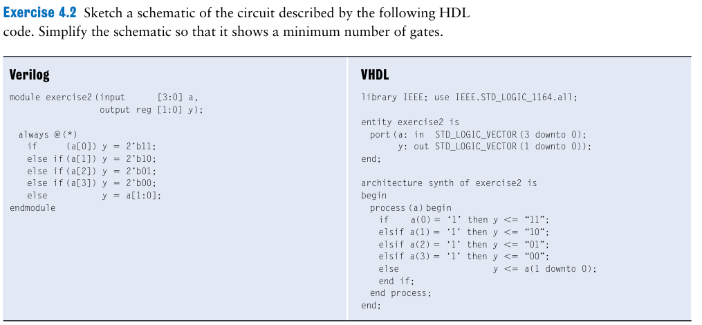
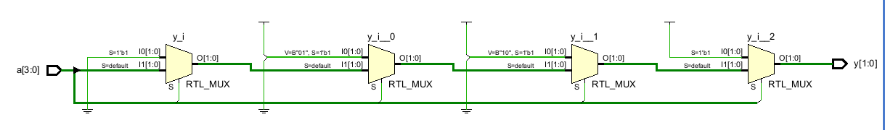
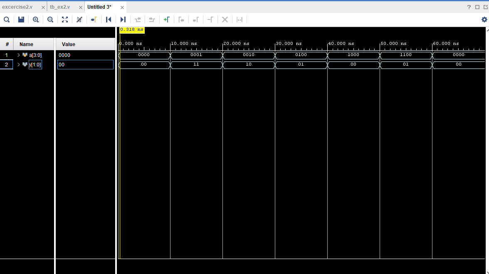

# exercises2



### Solution:

- RTL design :



GIải thích sơ đồ RTL: 

- đầu tiên: sẽ gán S default = a[1,0]→ nếu qua bộ mux thứ nhất, tín hiệu S ( condition) là tín hiệu a[0], nói cách khác thì các condition của 4 bộ mux đấy là lần lượt các đường dây tín hiệu a[0],a[1],a[2],a[3]. và mạch sẽ chạy theo điều kiện đến khi có kết quả cuối cùng
- các tín hiệu đi vào bộ mux ví dụ ở bộ mux thứ 2, có nối âm và dương, ở đây nên hiểu là trường hợp 0,1 9 đã ghi cụ thể trong RTL

Lời giải: 

✅ **Cấu trúc mạch tối ưu**

➤ y[1] = a[1] + a[0]

➤ y[0] = a[0] + (a[2] · has_input)

Ở đây, has_input = a[0] + a[1] + a[2] + a[3].

❗ Lưu ý:

- Khi a[0] = 1 → ưu tiên cao nhất, nên các OR phía sau không cần kiểm tra.
- Với a = 0000 → y = a[1:0] = 00 → tự nhiên.

────────────────────────────────────────────

✅ **Sơ đồ mạch cuối cùng (rất tối giản)**

- has_input = a[0] + a[1] + a[2] + a[3]
- y[1] = a[1] + a[0]
- y[0] = a[0] + (a[2] · has_input)

Tổng số cổng:

- OR 4-input → 1 cổng (has_input)
- OR 2-input → 2 cổng (cho y[1], y[0])
- AND 2-input → 1 cổng (a[2] · has_input)

==> Chỉ cần **4 cổng logic** (ít hơn phương án encoder + MUX ban đầu). 🎯

- Design

```verilog

module exercise2(input [3:0] a,
 output reg [1:0] y);
 always @(*)
     if (a[0])y = 2'b11;
     else if(a[1]) y = 2'b10;
     else if(a[2]) y =2'b01;
     else if(a[3]) y =2'b00;
     else y = a[1:0];
 endmodule
```

- testbench

```verilog
`timescale 1ns / 1ps

module tb_exercise2();

    reg [3:0] a;
    wire [1:0] y;

    exercise2 uut(
        .a(a), 
        .y(y)
    );
    
    initial begin
        a = 4'b0000; #10;   
        a = 4'b0001; #10;   
        a = 4'b0010; #10;   
        a = 4'b0100; #10;   
        a = 4'b1000; #10;   
        a = 4'b1100; #10;   
        a = 4'b0000; #10;   
        $finish;
    end

endmodule

```

- waveform

