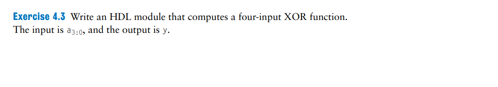
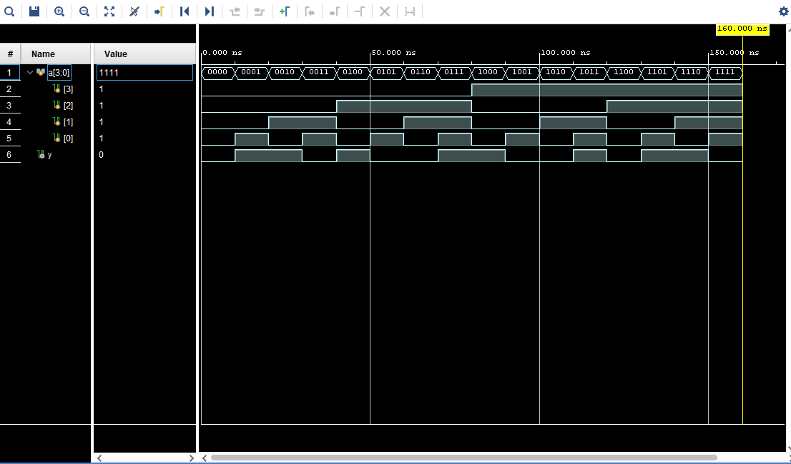

# exercise3



Solution:  

Thiết kế mạch xor-4 bit, với số bit bằng 1 là lẻ thì kết quả sẽ là 1 và ngược lại

- HDL code

```verilog
`timescale 1ns / 1ps

module xor4(
    input [3:0]a,
    output y
    );
    
assign y = ^a ; // reduction XOR trong Verilog , nó sẽ tự XOR toàn bộ các bit trong vector
endmodule
```

- Testbench

```verilog
`timescale 1ns / 1ps

module tb_xor4;

    reg [3:0] a;
    wire y;
    integer i;

    xor4 uut (
        .a(a),
        .y(y)
    );

    initial begin
        $monitor("Time=%0t | a=%b | y=%b", $time, a, y);
        for (i = 0; i < 16; i = i + 1) begin
            a = i; #10;
        end
        $finish;
    end

endmodule

```

- cách kiểm tra 

    XOR nhiều bit = số lượng bit ‘1’ là lẻ → output = 1.

    Số lượng bit ‘1’ là chẵn → output = 0.


- waveform

