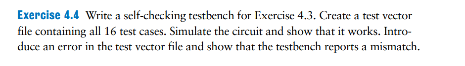
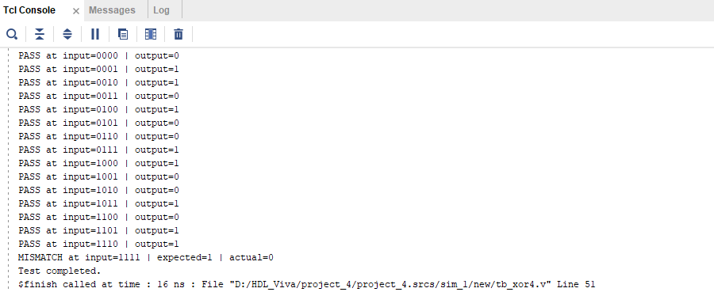
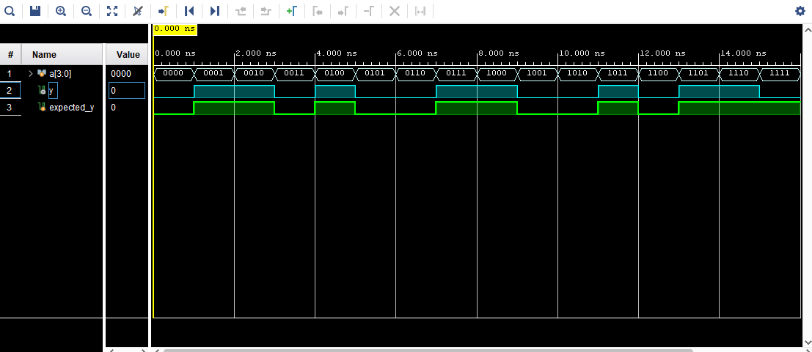

# exercise4



Yêu cầu: 

Viết một testbench tự kiểm tra (self-checking) cho Bài 4.3.

Tạo một file vector kiểm thử chứa toàn bộ 16 trường hợp kiểm thử.

Mô phỏng mạch và chứng minh rằng nó hoạt động đúng.

Sau đó cố ý giới thiệu một lỗi trong file vector kiểm thử và chứng minh rằng testbench phát hiện ra lỗi (báo mismatch).

### Solution:

- Như bài số 3, chúng ta kiểm tra bằng cách đối chiếu output với bảng chân lý. Yêu cầu của bài này có 2 hướng:
    - Cách 1: viết file vector.txt với nội dung các input và output sau đó nhúng file vào mã testbench
    - Cách 2: nhúng trực tiếp vector vào Verilog
    
    ⇒ vì mình đang dùng vivado để code và mô phỏng, nên mình sẽ chọn nhúng trực tiếp vào code testbench
    

- Testbench

```verilog
`timescale 1ns / 1ps

module tb_xor4;

    reg [3:0] a;
    wire y;
    reg expected_y;

    reg [4:0] test_vectors [0:15];  // Mảng 16 phần tử, mỗi phần tử 5 bit
    integer i;

    // Instantiation module DUT
    xor4 uut (
        .a(a),
        .y(y)
    );

    initial begin
        // Gán test vectors
        test_vectors[0]  = 5'b00000;
        test_vectors[1]  = 5'b00011;
        test_vectors[2]  = 5'b00101;
        test_vectors[3]  = 5'b00110;
        test_vectors[4]  = 5'b01001;
        test_vectors[5]  = 5'b01010;
        test_vectors[6]  = 5'b01100;
        test_vectors[7]  = 5'b01111;
        test_vectors[8]  = 5'b10001;
        test_vectors[9]  = 5'b10010;
        test_vectors[10] = 5'b10100;
        test_vectors[11] = 5'b10111;
        test_vectors[12] = 5'b11000;
        test_vectors[13] = 5'b11011;
        test_vectors[14] = 5'b11101;
        test_vectors[15] = 5'b11111; // trường hợp để sai để kiểm tra trên màn hình console

        $display("Starting self-checking testbench...");

        for (i = 0; i < 16; i = i + 1) begin
            {a, expected_y} = test_vectors[i]; // gán lần lượt 4 bit vào đầu vào và bit cuối cho expected _y
            #1;  // Đợi 1ns để ổn định

            if (y !== expected_y) begin
                $display("MISMATCH at input=%b | expected=%b | actual=%b", a, expected_y, y);
            end else begin
                $display("PASS at input=%b | output=%b", a, y);
            end
        end

        $display("Test completed.");
        $finish;
    end

endmodule

```

- test case TCL console



- waveform



### 📝 **Kết luận**

Trong testbench, mình đã nhúng trực tiếp 16 test case vào mã code để kiểm tra module XOR4.

Ở test case cuối cùng, theo đúng bảng chân lý, giá trị mong đợi của `y` phải là `0`. Tuy nhiên, mình cố tình thay giá trị expected thành `1` để kiểm tra khả năng phát hiện lỗi.

Kết quả: khi chạy mô phỏng, cửa sổ **Tcl Console** đã hiển thị chính xác thông báo `MISMATCH`, đúng như yêu cầu kiểm thử tự động mà mình đặt ra.

---