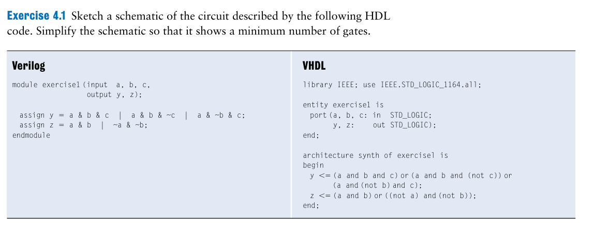
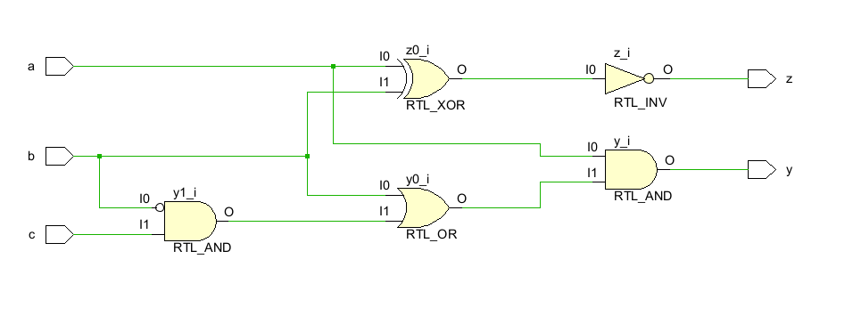
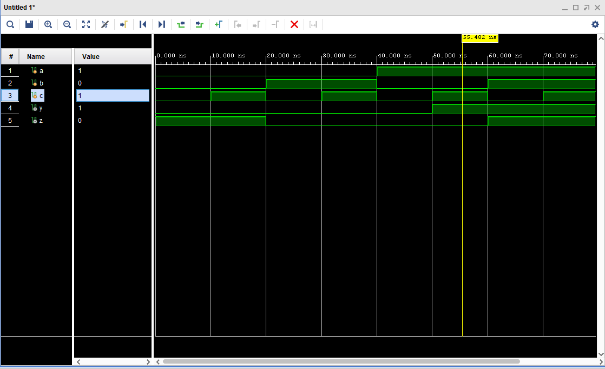

# Exercise1



Giải: 

- code tối ưu đoạn mã: tối ưu hàm cho Y và Z ( XNOR)
- Mã

```verilog

module exercises1(
    input a,
    input b,
    input c,
    output y,
    output z
    );

assign y = a & ( b | ~b&c); 
assign z = ~(a ^ b);
endmodule

```

- Testbench

```verilog
`timescale 1ns / 1ps

module tb_ex1(

    );
// Khai báo biến mô phỏng
reg a,b,c;
wire y,z; 

// khởi tạo instance của module cần test
// câu lệnh mapping giữa testbench và module thiết kế
//với .a ~ là tên cổng của module thiết kế trong file design
// trong ngoặc là tín hiệu được khai báo trong testbench 
// .module_port(testbench_signal)
exercises1 uut( // uut ~ unit under test
    .a(a),
    .b(b), 
    .c(c),
    .y(y),
    .z(z)
);

// Viết khối initial để tạo sóng tín hiệu
initial begin
    // Ghi sóng đầu ra
    $monitor("Time=%0t a=%b b=%b c=%b | y=%b z=%b", $time, a, b, c, y, z);

    // Tổ hợp 000
    a = 0; b = 0; c = 0; #10;
    // Tổ hợp 001
    a = 0; b = 0; c = 1; #10;
    // Tổ hợp 010
    a = 0; b = 1; c = 0; #10;
    // Tổ hợp 011
    a = 0; b = 1; c = 1; #10;    // Tổ hợp 100
    a = 1; b = 0; c = 0; #10;
    // Tổ hợp 101
    a = 1; b = 0; c = 1; #10;
    // Tổ hợp 110
    a = 1; b = 1; c = 0; #10;
    // Tổ hợp 111
    a = 1; b = 1; c = 1; #10;

    $finish;
end

endmodule

```

- RTL _design



- wave form

